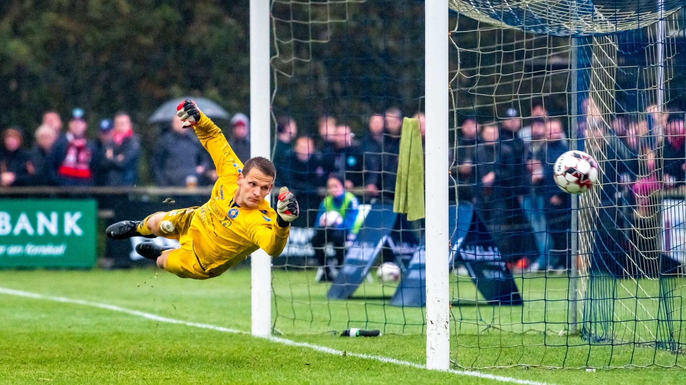
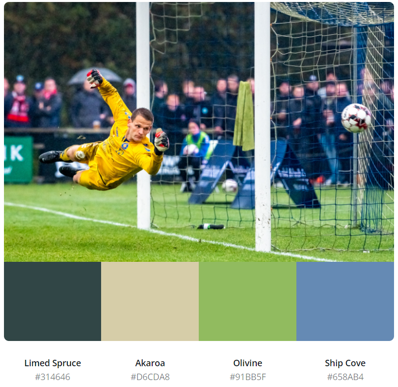

# FOOTIEMANIA

## Welcome to Footiemania, the online quiz for people who LOVE all about football, including the facts!

_Do you know that Pele scored more than 1200 goals in his career? Or which country won the first World Cup?_ Yes, it was Uruguay!

If facts like these make you smile, let’s play! Press the yellow start button and enjoy testing your own knowledge.

Footiemania is the perfect football quiz application for football enthusiasts of all ages who love everything about this sport, including the generally “boring stuff" like facts about the football players and their backgrounds, the teams, the premier league and various other competitions. But these facts are only boring if you’re not into football. If you are, whether you get excited about chasing the football on the pitch or watching the game from the comfort of your home, get ready and have some fun! You might even learn something new, you never know. ;-) 

---

## Showcase

- A deployed link to the website can be found [here.](https://psnaz.github.io/footiemania/) 
- The purpose of this quiz is to have fun and test the user's knowledge about the game.
- This one page quiz application is designed to be responsive and accessible on a range of devices, making it easy to navigate for the audience.

---

## Features

### Logo Area
- The top of the page includes a green logo area.

###  Landing Page Image
- Right below the logo area is a striking photograph of a goalkeeper letting a goal in.

### Tagline
- Below the hero image is a welcoming tagline that should entice the user to start playing this quiz.

### Game Area Displayed Before Start

- The bottom part of the screen is dedicated to the responsive part of the game area. It includes a yellow START button and below score count set to 0 for both, correct and incorrect answers.

### Question Area

#### Question Area Displayed Once START Button Displayed
- Once the start button's pressed, a white question area appears. It includes a quiz question and 4 interactive light blue buttons with a choice of answers.

#### Question Area - CORRECT ANSWER DISPLAYED
- When the user clicks one of the blue answer buttons and chooses the correct answer the answer buttons change colour: the correct answer button turns green, the rest of the answer buttons for wrong answers turn red. Also, the game area background colour turns green to indicate the success.
- At the same time, yellow button NEXT appears and the score in the correct answers increases by 1.

#### Question Area - WRONG ANSWER DISPLAYED
- When the user clicks one of the blue answer buttons and chooses a wrong answer the answer buttons change colour: the correct answer button turns green, the rest of the answer buttons for wrong answers turn red. Also, the game area background colour turns red to indicate that a wrong answer's been chosen.
- At the same time, yellow button NEXT appears and the score in the incorrect answers increases by 1.

### Next Button
- To be able to proceed to the next question the user has to press the NEXT yellow button. 
- When the NEXT button is pressed, the next question is displayed. 

### Score Area
- The score area is there to count the score that increases or decreases always by 1 depending if the user chooses a correct or incorrect answer.

### QUESTIONS

- There are currently 11 questions only stored in the js file of the quiz game.
- Potentially, hundreds of questions could be added to this game.

---

## User Experience (UX)

The target audience (end users) of this project are football enthusiasts of all ages, predominantly boys between 10-14 who _“live and breathe”_ football like my son. The target audience can be very similar with users of a Nintendo game FIFA20.

The end user is looking for a fun way to be entertained while testing and also expanding their knowledge about football.

The benefit of this project is fun and learning at the same time.
The score count feature can monitor the players’ improvement and/or can enable to enjoy a fun competitive game when socializing at home.

### User Stories

- As an end user I want to have some fun and learn something new at the same time.
- As an end user I want to get excited about testing my knowledge  
- As an end user I want to receive clear instructions to be able to understand what this quiz is about, how to play it and score points.
- As an end user I want to be able to read and understand the questions and answers easily.
- As an end user I want to be able to play this quiz game on a variety of devices, like a mobile phone or laptop, but also a desktop.

## Strategy 

### Steps Taken

- Project ideas jotted down in a notepad and a mind map created (pen & paper)
- Hero image searched for on pixabay.com and unspleash.com
- Various quizzes researched on Google and Youtube
- Quiz questions created in cooperation with my 10 year old football savvy son, Martin Snazle, who loves quizzing me on all football and keeps laughing at my lack of knowledge
- Application outlined, researched and written in Google docs

- Colour palette created in canva.com

- Mockup design created in canva.com and can be viewed [here.](https://www.canva.com/design/DAE435igaz4/8yfnZsaV_IAiWw6dCBzHgQ/edit?utm_content=DAE435igaz4&utm_campaign=designshare&utm_medium=link2&utm_source=sharebutton)

- Planning Session 1 with my mentor (Call 1)
- GitHub repository created [here](https://github.com/psnaz/footiemania)
- Project broke down into smaller tasks and To-Do List created in Google docs
- README file content outlined and written in Google docs
- Building work/ Coding started in Gitpod
- Project several times deleted and started again 
- Project Session 2 with my mentor (Call 2) - cancelled and rescheduled 2 or 3 times, in the end cancelled due to the lack of progress at the time and not rescheduled due to the tight deadline 
- Project finalized, tested
- Project submitted to the Code Institute for marking

## Technologies Used

### Languages Used
- HTML5
- CSS3
- JavaScript

### Frameworks, Libraries and Programs Used

- unsplash.com: Unsplash was used to find the hero image: image used taken by   
- Canva.com: Canva Color Palette Generator was used to create a color palette and Canva was used to create a mock-up design, and for resizing and editing images.
- Google Fonts: Google fonts were used to import the ‘Black Ops One’ and ‘Montserrat light 400’ fonts into the style.css files. 
- Git: Git was used for version control by utilizing the Gitpod terminal - to commit to Git and push to GitHub
- GitHub: Github is used to store the project's code after being pushed from Git.
- GoogleDev Tools used to see the element positioning and responsiveness, and view JavaScript console
- TinyPNG was used to compress the images

---

## Credits 

### Code

#### The majority of the code came from:
-[’Build A Quiz App With JavaScript’ tutorial](https://www.youtube.com/watch?v=riDzcEQbX6k) by Web Dev Simplified.
-CI Love Maths Walkthrough project 

#### Otherwise based on the Diploma in Software Development study materials and my notes taken while going through the materials.

#### Other materials studied:
- [Build a Quiz in Javascript](https://www.kindsonthegenius.com/javascript/quiz-application-in-javascript-with-validation-step-by-step/) by Kindson The Genius
- [Building a Simple Quiz with HTML, CSS and JavaScript](https://dev.to/sulaimonolaniran/building-a-simple-quiz-with-html-css-and-javascript-4elp) by Sulaimon Olaniran
- [Create a Quiz App with Timer using HTML CSS & JavaScript](https://www.codingnepalweb.com/quiz-app-with-timer-javascript/) by Coding Nepal
- [How to Make a Basic JavaScript Quiz](https://www.wikihow.com/Make-a-Basic-JavaScript-Quiz) by wikiHow

- [MDN Web Docs](https://developer.mozilla.org/en-US/): Used to extend my knowledge and deepen understanding of HTML, CSS and JavaScript 

### Content

- All content was written by the developer. The questions and answers were created together as a mum and son project with Martin Snazle – my ten-year old boy that loves playing football more than anything. Martin also loves watching football and quizzing his mum about football daily.  

### Media

- Hero image taken by   
 downloaded from unspleash.com

### Acknowledgements

- My ten year old son, Martin Snazle, who loves football more than anything, and who also loves quizzing me on football and laugh when I don’t know much. I treasure those moments!

- My Mentor Celestine Okoro for his helpful feedback.
- Tutor support at Code Institute for their support.
- Stephen Seagrave for his most valuable advice recorded as [Milestone 1 Planning with Stephen Seagrave.](https://www.youtube.com/watch?v=06tXTbm-DxI&feature=youtu.be)
- Code Institute Slack Community for all their advice and support.

---

## Testing

The W3C Markup Validator, W3C CSS Validator Services, Lighthouse Chrome Extension and JS Hint were used to validate the project page to ensure that there were no syntax errors in the project.

- W3C Markup Validator - Results in the screenshot - see below:

- W3C CSS Validator - Results in the screenshot - see below:

- [JS HInt](https://jshint.com/) - Results in the screenshots below:  

--- 

## Unfixed Bugs

Bugs not fixed in js file due to the lack of time and understanding what exactly needs to be fixed, more time needed.

---

## Deployment

This site was deployed to GitHub pages by taking the following steps:
1. In the GitHub repository click on the settings tab on the right hand site
2. Scroll down to the GitHub pages heading that informs you that 'Pages setting now has its own tab' and click on the link next to it.
3. Select source and select 'main' and save, this will refresh the page.
4. Scroll down to the GitHub Pages section again to see the deployed link and click on it.
5. Please note that it might take a few minutes for Github to build the site.

---

## Forking the GitHub Repository OR Making a Local Clone

If you are interested how to fork this repository or how to make a local clone, this information can be found in Github documentation [here.](https://docs.github.com/en/repositories/creating-and-managing-repositories/cloning-a-repository)

---

## NOTES

This project has been a very steep learning curve. Although I find the JavaScript principle understandable to use JavaScript in practice and write my own code at this point is very challenging for me. I understand that I will have to practise a lot to feel confident using it and to become a proper JavaScript user. 

My original plan was to create an interactive football quiz with sound effects like the football fans cheering or booing in the background depending if the user scores. Unfortunately, due to the steep learning curve and this project being deleted and restarted several times which reduced my time to develop this project more, I was unable to stick to my original plan and create the app as I imagined at the beginning of starting this module on Comparative Programming Languages and JavaScript.

